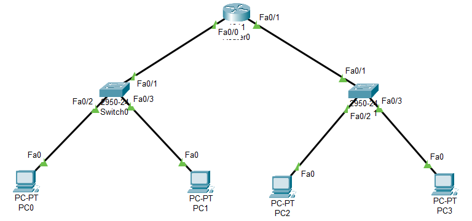

# Configuración Básica de Enrutamiento e Interfaces de Red


## 📖 Descripción General

Este repositorio contiene una simulación de red diseñada en **Cisco Packet Tracer**. El objetivo principal del proyecto es demostrar la conectividad fundamental de Capa 3 entre distintas subredes utilizando un único enrutador (Router).

El ejercicio ilustra cómo los dispositivos finales (PCs) en diferentes Redes de Área Local (LAN) se comunican a través de una Puerta de Enlace Predeterminada (Default Gateway), destacando el papel del router en el direccionamiento del tráfico entre redes conectadas directamente.

## 🏗️ Topología de la Red

La arquitectura consta de dos segmentos de red separados, interconectados por un router central.

*   **Red A (Izquierda):** `192.168.0.0/24`
*   **Red B (Derecha):** `192.168.1.0/24`
*   **Interconexión:** Router actuando como Gateway para ambas subredes.



## 💻 Detalles de Implementación

### Esquema de Direccionamiento IP

La siguiente tabla detalla la configuración aplicada a todos los dispositivos en la simulación:

| Dispositivo | Interfaz | Dirección IP | Máscara de Subred | Gateway Predeterminado |
| :--- | :--- | :--- | :--- | :--- |
| **PC0** | NIC | `192.168.0.2` | `255.255.255.0` | `192.168.0.1` |
| **PC1** | NIC | `192.168.0.3` | `255.255.255.0` | `192.168.0.1` |
| **PC2** | NIC | `192.168.1.2` | `255.255.255.0` | `192.168.1.1` |
| **PC3** | NIC | `192.168.1.3` | `255.255.255.0` | `192.168.1.1` |
| **Router0** | Fa0/0 | `192.168.0.1` | `255.255.255.0` | *N/A* |
| **Router0** | Fa0/1 | `192.168.1.1` | `255.255.255.0` | *N/A* |

### Configuración del Router (Cisco IOS)

El router se configuró para habilitar las interfaces y asignar direcciones de Capa 3. Dado que las redes están conectadas directamente, no fue necesario configurar protocolos de enrutamiento estático o dinámico en esta etapa.

```bash
# Ingresar al modo de configuración global
enable
configure terminal

# Configurar Gateway para la Red A
interface FastEthernet0/0
 description Gateway_Red_A
 ip address 192.168.0.1 255.255.255.0
 no shutdown
 exit

# Configurar Gateway para la Red B
interface FastEthernet0/1
 description Gateway_Red_B
 ip address 192.168.1.1 255.255.255.0
 no shutdown
 exit

# Guardar configuración
end
write memory
```

## 🧪 Verificación y Pruebas

Se verificó la conectividad utilizando paquetes ICMP (`ping`) para asegurar que la lógica de enrutamiento funciona correctamente.

### Casos de Prueba:
1.  **Conectividad LAN Local:**
    *   `PC0` hacia `PC1` (Misma subred) → **Exitoso**
2.  **Alcance del Gateway:**
    *   `PC0` hacia `Interfaz del Router` (`192.168.0.1`) → **Exitoso**
3.  **Conectividad Remota (Entre Redes):**
    *   `PC0` (Red A) hacia `PC2` (Red B) → **Exitoso**


## 🔧 Requisitos Previos

*   **Cisco Packet Tracer** (Versión 7.0 o superior recomendada).
*   Conocimientos básicos de direccionamiento IP y máscaras de subred.