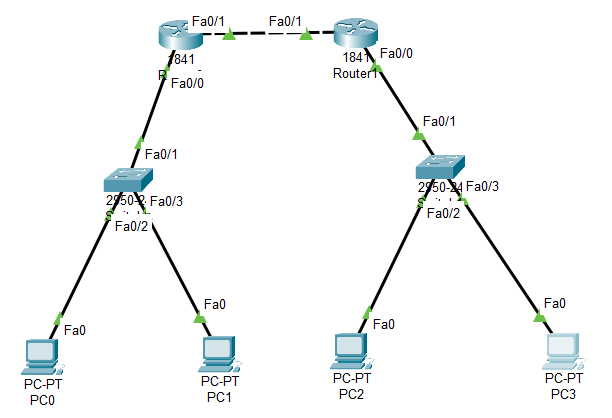

# Laboratorio: Enrutamiento Estático entre Routers (Ejemplo 2)


## 📖 Descripción del Proyecto

Este repositorio documenta la solución al **Ejemplo 2** de la Guía de Laboratorio de Infraestructura de Redes. El objetivo es interconectar dos redes LAN geográficamente separadas (`192.168.0.0` y `192.168.1.0`) mediante un enlace WAN dedicado entre dos routers Cisco 1841.

La configuración sigue estrictamente los parámetros establecidos en la documentación oficial (Pág. 9), implementando **rutas estáticas** para permitir la comunicación bidireccional.

## 🏗️ Topología de Red

La red se divide en tres segmentos lógicos:

1.  **Red LAN A (Izquierda):** `192.168.0.0/24`
2.  **Red LAN B (Derecha):** `192.168.1.0/24`
3.  **Red WAN (Enlace Central):** `192.168.2.0/24`



## ⚙️ Configuración y Direccionamiento

### Tabla de Direcciones IP
Esta configuración respeta el esquema propuesto en el ejercicio, donde las IPs del enlace WAN son **Router1 (.1)** y **Router0 (.2)**.

| Dispositivo | Interfaz | Dirección IP | Máscara | Gateway / Next Hop |
| :--- | :--- | :--- | :--- | :--- |
| **PC0** | NIC | `192.168.0.2` | `255.255.255.0` | `192.168.0.1` |
| **PC1** | NIC | `192.168.0.3` | `255.255.255.0` | `192.168.0.1` |
| **PC2** | NIC | `192.168.1.2` | `255.255.255.0` | `192.168.1.1` |
| **PC3** | NIC | `192.168.1.3` | `255.255.255.0` | `192.168.1.1` |
| **Router0** | Fa0/0 (LAN) | `192.168.0.1` | `255.255.255.0` | - |
| **Router0** | Fa0/1 (WAN) | **192.168.2.2** | `255.255.255.0` | Conectado a R1 |
| **Router1** | Fa0/0 (LAN) | `192.168.1.1` | `255.255.255.0` | - |
| **Router1** | Fa0/1 (WAN) | **192.168.2.1** | `255.255.255.0` | Conectado a R0 |

### Comandos de Configuración (Cisco IOS)

#### 1. Configuración Router0 (Izquierda)
Este router aprende a llegar a la red derecha saltando hacia la IP del Router1.

```bash
enable
configure terminal

# Interfaces
interface FastEthernet0/0
 ip address 192.168.0.1 255.255.255.0
 no shutdown
interface FastEthernet0/1
 ip address 192.168.2.2 255.255.255.0
 no shutdown
 exit

# Enrutamiento Estático
# Destino: 192.168.1.0 -> Siguiente Salto: 192.168.2.1
ip route 192.168.1.0 255.255.255.0 192.168.2.1
```

#### 2. Configuración Router1 (Derecha)
Este router aprende a llegar a la red izquierda saltando hacia la IP del Router0.

```bash
enable
configure terminal

# Interfaces
interface FastEthernet0/0
 ip address 192.168.1.1 255.255.255.0
 no shutdown
interface FastEthernet0/1
 ip address 192.168.2.1 255.255.255.0
 no shutdown
 exit

# Enrutamiento Estático
# Destino: 192.168.0.0 -> Siguiente Salto: 192.168.2.2
ip route 192.168.0.0 255.255.255.0 192.168.2.2
```

## 🧪 Pruebas y Verificación

Para confirmar el éxito de la práctica, se realizaron las siguientes pruebas de conectividad.

### Prueba de Conectividad (Ping Extremo a Extremo)
El objetivo principal es que una PC de la **Red A** se comunique con una PC de la **Red B**.

*   **Origen:** PC0 (`192.168.0.2`)
*   **Destino:** PC2 (`192.168.1.2`)
*   **Resultado:** Exitoso (Reply from 192.168.1.2).

> **Nota:** El primer paquete suele perderse (*Request timed out*) debido al protocolo ARP. Los siguientes deben ser exitosos.


### Verificación de Tabla de Rutas
En el Router0, el comando `show ip route` muestra la ruta estática **S** apuntando correctamente:

```text
S    192.168.1.0/24 [1/0] via 192.168.2.1
C    192.168.0.0/24 is directly connected, FastEthernet0/0
C    192.168.2.0/24 is directly connected, FastEthernet0/1
```

### 🔧 Requisitos
- Cisco Packet Tracer v7.0 o superior.
- Conocimiento básico de direccionamiento IPv4 y Gateways.