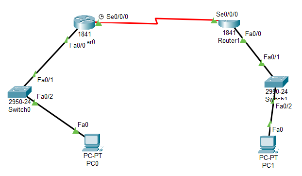

# Configuración de Enlaces Seriales con Hardware (Ejemplo 3)


## 📖 Descripción
Este laboratorio (Ejemplo 3) simula una conexión WAN real utilizando interfaces seriales. Se sigue estrictamente la configuración de la Guía, donde el **Router0 actúa como DCE** (pone el reloj) y el **Router1 como DTE**.

## 🏗️ Topología
*   **Red Izquierda (Router0):** `9.0.0.0/8`
*   **Red Derecha (Router1):** `8.0.0.0/8`
*   **Enlace WAN Serial:** `4.0.0.0/8`



## 🔧 Instalación de Hardware
**¡Paso Obligatorio antes de configurar!**
1.  Apaga ambos routers (botón físico).
2.  Inserta el módulo **WIC-1T** en el slot derecho.
3.  Vuelve a encenderlos.

## 💻 Configuración Exacta (Según Guía Pág. 14)

### Tabla de Direccionamiento IP

| Dispositivo | Interfaz | IP | Gateway / Next Hop | Rol Serial |
| :--- | :--- | :--- | :--- | :--- |
| **PC0** | NIC | `9.0.0.2` | `9.0.0.1` | - |
| **PC1** | NIC | `8.0.0.2` | `8.0.0.1` | - |
| **Router0** | Fa0/0 | `9.0.0.1` | - | - |
| **Router0** | Se0/0/0 | **4.0.0.1** | Conectado a R1 | **DCE (Clock Rate)** |
| **Router1** | Fa0/0 | `8.0.0.1` | - | - |
| **Router1** | Se0/0/0 | **4.0.0.2** | Conectado a R0 | **DTE** |

### Comandos de Configuración

#### 1. Router0 (Izquierda - DCE)
Este router lleva la IP `.1` en el serial y el comando `clock rate` como indica la guía.

```bash
enable
configure terminal

# Interfaz LAN
interface FastEthernet0/0
 ip address 9.0.0.1 255.0.0.0
 no shutdown

# Interfaz Serial (DCE)
interface Serial0/0/0
 ip address 4.0.0.1 255.0.0.0
 clock rate 64000          <--- Configuración DCE
 no shutdown
 exit

# Ruta Estática (Apunta a la .2 del vecino)
ip route 8.0.0.0 255.0.0.0 4.0.0.2
```

#### 2. Router1 (Derecha - DTE)
Este router lleva la IP `.2` en el serial.

```bash
enable
configure terminal

# Interfaz LAN
interface FastEthernet0/0
 ip address 8.0.0.1 255.0.0.0
 no shutdown

# Interfaz Serial (DTE)
interface Serial0/0/0
 ip address 4.0.0.2 255.0.0.0
 no shutdown
 exit

# Ruta Estática (Apunta a la .1 del vecino)
ip route 9.0.0.0 255.0.0.0 4.0.0.1
```

## 🧪 Verificación y Pruebas

### 1. Trazado de Ruta (`tracert`)
Desde la **PC0**, comprobamos el camino hacia la **PC1**.

*   **Comando:** `tracert 8.0.0.2`
*   **Resultado Esperado:**
    1.  `9.0.0.1` (Router Local)
    2.  `4.0.0.2` (Router Remoto - Nótese que aquí aparece la .2)
    3.  `8.0.0.2` (PC Destino)


### 2. Verificación de Tabla de Rutas
En **Router0** (comando `show ip route`), la ruta estática debe verse así:

```text
S    8.0.0.0/8 [1/0] via 4.0.0.2
```