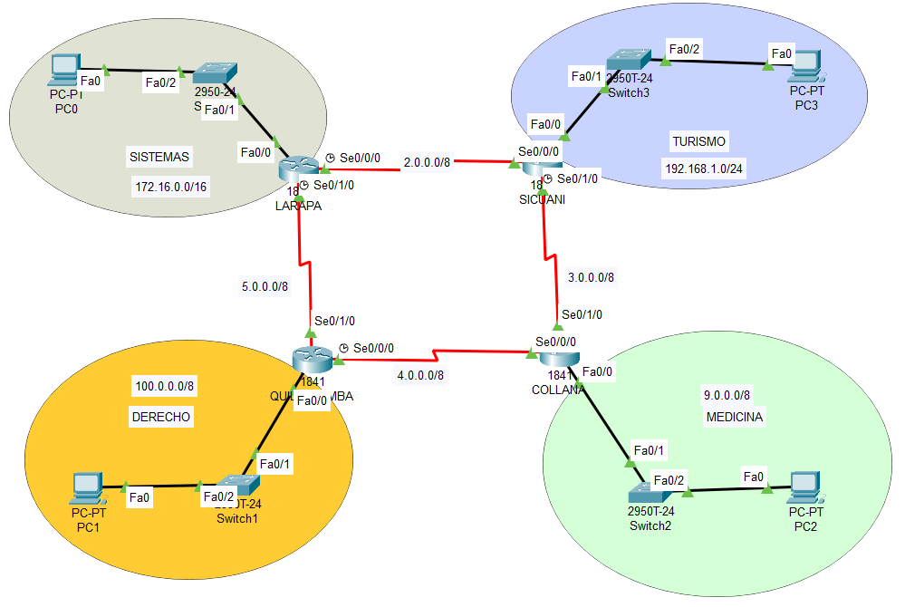
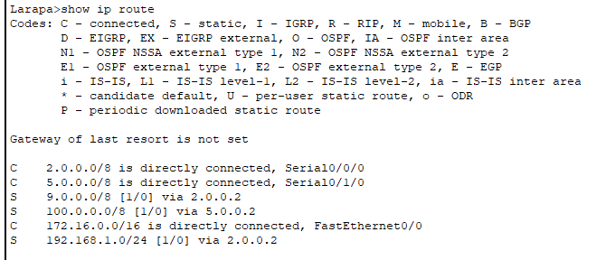
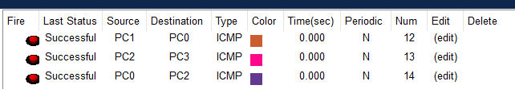

# Ejercicio Propuesto 1: Red WAN en Anillo (Cusco)


## 📖 Descripción del Proyecto
Este ejercicio consiste en la implementación de una red WAN que interconecta cuatro sedes principales (**Larapa, Sicuani, Quillabamba y Collana**) formando una topología lógica en anillo. 

Se ha configurado direccionamiento IP jerárquico, interfaces seriales síncronas (DCE) y asíncronas (DTE), y enrutamiento estático para garantizar la conectividad total entre las redes LAN de cada sede.

## 🏗️ Topología de Red
La red utiliza enlaces seriales para la WAN y FastEthernet para las LANs locales.


*(Asegúrate de subir aquí la captura donde se ven todos los triángulos verdes)*

## 📋 Documentación de Direccionamiento IP

A continuación, se detalla la asignación de direcciones IP tal como se solicita en la Guía de Laboratorio:

| EQUIPO | INTERFAZ | DIRECCIÓN IP | MÁSCARA | NOTAS (DCE/DTE) |
| :--- | :--- | :--- | :--- | :--- |
| **Larapa** | fa0/0 | 172.16.0.1 | 255.255.0.0 | Gateway LAN |
| | se0/0/0 | 2.0.0.1 | 255.0.0.0 | DCE (Clock 64000) |
| | se0/1/0 | 5.0.0.1 | 255.0.0.0 | DCE (Clock 64000) |
| **Sicuani** | fa0/0 | 192.168.1.1 | 255.255.255.0 | Gateway LAN |
| | se0/0/0 | 2.0.0.2 | 255.0.0.0 | DTE |
| | se0/1/0 | 3.0.0.1 | 255.0.0.0 | DCE (Clock 64000) |
| **Quillabamba**| fa0/0 | 100.0.0.1 | 255.0.0.0 | Gateway LAN |
| | se0/1/0 | 5.0.0.2 | 255.0.0.0 | DTE |
| | se0/0/0 | 4.0.0.1 | 255.0.0.0 | DCE (Clock 64000) |
| **Collana** | fa0/0 | 9.0.0.1 | 255.0.0.0 | Gateway LAN |
| | se0/1/0 | 3.0.0.2 | 255.0.0.0 | DTE |
| | se0/0/0 | 4.0.0.2 | 255.0.0.0 | DTE |

---

## ⚙️ Configuración Técnica (Cisco IOS)

### 1. Sede Larapa (Router Superior Izquierdo)
Actúa como nodo central distribuyendo reloj a Sicuani y Quillabamba.

```bash
enable
configure terminal
hostname Larapa

! LAN
interface FastEthernet0/0
 ip address 172.16.0.1 255.255.0.0
 no shutdown

! WAN a Sicuani (DCE)
interface Serial0/0/0
 ip address 2.0.0.1 255.0.0.0
 clock rate 64000
 no shutdown

! WAN a Quillabamba (DCE)
interface Serial0/1/0
 ip address 5.0.0.1 255.0.0.0
 clock rate 64000
 no shutdown

! Enrutamiento Estático
ip route 192.168.1.0 255.255.255.0 2.0.0.2
ip route 100.0.0.0 255.0.0.0 5.0.0.2
ip route 9.0.0.0 255.0.0.0 2.0.0.2
exit
```

### 2. Sede Sicuani (Router Superior Derecho)

```bash
enable
configure terminal
hostname Sicuani

! LAN
interface FastEthernet0/0
 ip address 192.168.1.1 255.255.255.0
 no shutdown

! WAN a Larapa
interface Serial0/0/0
 ip address 2.0.0.2 255.0.0.0
 no shutdown

! WAN a Collana (DCE)
interface Serial0/1/0
 ip address 3.0.0.1 255.0.0.0
 clock rate 64000
 no shutdown

! Enrutamiento Estático
ip route 172.16.0.0 255.255.0.0 2.0.0.1
ip route 9.0.0.0 255.0.0.0 3.0.0.2
ip route 100.0.0.0 255.0.0.0 2.0.0.1
exit
```

### 3. Sede Quillabamba (Router Inferior Izquierdo)

```bash
enable
configure terminal
hostname Quillabamba

! LAN
interface FastEthernet0/0
 ip address 100.0.0.1 255.0.0.0
 no shutdown

! WAN a Larapa
interface Serial0/1/0
 ip address 5.0.0.2 255.0.0.0
 no shutdown

! WAN a Collana (DCE)
interface Serial0/0/0
 ip address 4.0.0.1 255.0.0.0
 clock rate 64000
 no shutdown

! Enrutamiento Estático
ip route 172.16.0.0 255.255.0.0 5.0.0.1
ip route 9.0.0.0 255.0.0.0 4.0.0.2
ip route 192.168.1.0 255.255.255.0 5.0.0.1
exit
```

### 4. Sede Collana (Router Inferior Derecho)

```bash
enable
configure terminal
hostname Collana

! LAN
interface FastEthernet0/0
 ip address 9.0.0.1 255.0.0.0
 no shutdown

! WAN a Sicuani
interface Serial0/1/0
 ip address 3.0.0.2 255.0.0.0
 no shutdown

! WAN a Quillabamba
interface Serial0/0/0
 ip address 4.0.0.2 255.0.0.0
 no shutdown

! Enrutamiento Estático
ip route 192.168.1.0 255.255.255.0 3.0.0.1
ip route 100.0.0.0 255.0.0.0 4.0.0.1
ip route 172.16.0.0 255.255.0.0 3.0.0.1
exit
```

## 🧪 Verificación y Pruebas

### 1. Tabla de Enrutamiento (`show ip route`)
Verificación en el router **Larapa**. Se observan las rutas estáticas (**S**) aprendidas hacia las otras 3 redes.



### 2. Prueba de Conectividad (Ping)
Se realizó una prueba de conectividad desde la PC de Sistemas (Larapa) hacia la PC de Medicina (Collana), atravesando la red WAN.

*   **Origen:** 172.16.0.2
*   **Destino:** 9.0.0.2
*   **Resultado:** Exitoso.

