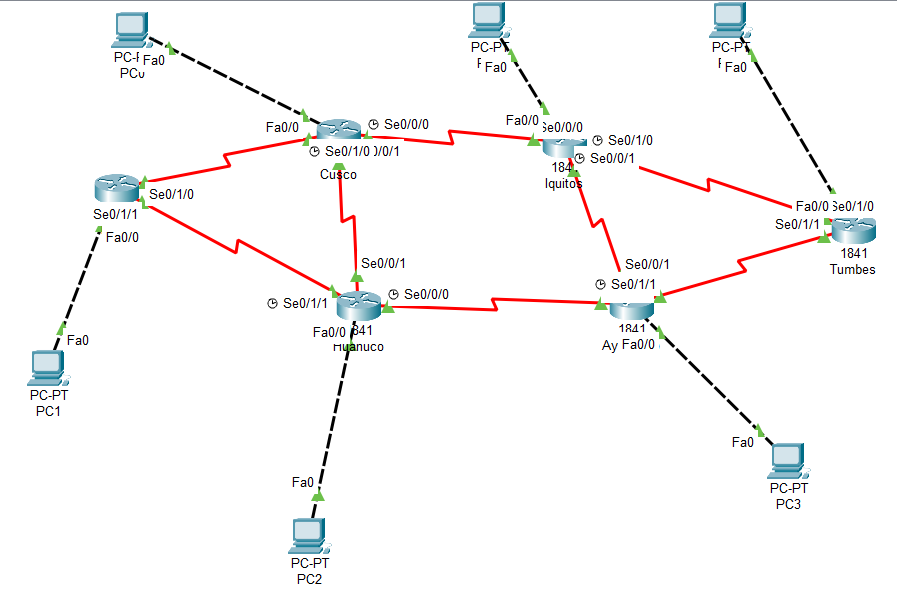

# Ejercicio Propuesto 2: Red en Malla Parcial (Ciudades del Perú)


## 📖 Descripción del Proyecto
Este ejercicio implementa una infraestructura de red WAN de alta disponibilidad conectando 6 ciudades principales del Perú. La topología de malla parcial ofrece múltiples rutas redundantes entre las sedes.

**Nota Técnica:** Se ha utilizado direccionamiento IP estático (Clases A, B y C según diagrama) y se han instalado módulos de hardware **WIC-2T** adicionales en los routers centrales para soportar la densidad de conexiones seriales.

## 🏗️ Topología de Red

### Requisito Físico Importante
*   **Conexión WAN (Router-Router):** Cable Serial (Rojo).
*   **Conexión LAN (Router-PC):** **Cable Cruzado / Crossover** (Línea negra punteada). *Esto es necesario porque se conecta un Router directamente a una PC sin Switch intermedio.*



## 📋 Tabla de Direccionamiento y Conexiones

| Sede (Router) | PC Usuario | IP Gateway (LAN) | Interfaces WAN Activas |
| :--- | :--- | :--- | :--- |
| **CUSCO** | PC0 | `63.0.0.1` | Se0/1/0, Se0/0/0, Se0/0/1 |
| **TACNA** | PC1 | `95.0.0.1` | Se0/1/0, Se0/1/1 |
| **HUÁNUCO** | PC2 | `129.0.0.1` | Se0/1/1, Se0/0/1, Se0/0/0 |
| **AYACUCHO** | PC3 | `200.45.26.1` | Se0/0/0, Se0/1/1, Se0/0/1 |
| **TUMBES** | PC4 | `172.16.0.1` | Se0/1/1, Se0/1/0 |
| **IQUITOS** | PC5 | `192.168.1.1` | Se0/0/0, Se0/1/0, Se0/0/1 |

---

## ⚙️ Configuración Técnica Consolidada (Cisco IOS)

### 1. Router CUSCO
```bash
enable
configure terminal
hostname Cusco

! Configuración LAN (Cable Cruzado)
interface FastEthernet0/0
 ip address 63.0.0.1 255.0.0.0
 no shutdown

! Configuración WAN
interface Serial0/1/0
 description Link_a_Tacna
 ip address 9.0.0.2 255.0.0.0
 no shutdown
interface Serial0/0/0
 description Link_a_Iquitos_DCE
 ip address 4.0.0.1 255.0.0.0
 clock rate 64000
 no shutdown
interface Serial0/0/1
 description Link_a_Huanuco_DCE
 ip address 2.0.0.1 255.0.0.0
 clock rate 64000
 no shutdown

! Enrutamiento Estático
ip route 95.0.0.0 255.0.0.0 9.0.0.1
ip route 192.168.1.0 255.255.255.0 4.0.0.2
ip route 129.0.0.0 255.255.0.0 2.0.0.2
ip route 172.16.0.0 255.255.0.0 4.0.0.2
ip route 200.45.26.0 255.255.255.0 2.0.0.2
exit
```

### 2. Router TACNA
```bash
enable
configure terminal
hostname Tacna

! Configuración LAN
interface FastEthernet0/0
 ip address 95.0.0.1 255.0.0.0
 no shutdown

! Configuración WAN
interface Serial0/1/0
 description Link_a_Cusco_DCE
 ip address 9.0.0.1 255.0.0.0
 clock rate 64000
 no shutdown
interface Serial0/1/1
 description Link_a_Huanuco_DCE
 ip address 7.0.0.1 255.0.0.0
 clock rate 64000
 no shutdown

! Enrutamiento Estático
ip route 63.0.0.0 255.0.0.0 9.0.0.2
ip route 129.0.0.0 255.255.0.0 7.0.0.2
ip route 192.168.1.0 255.255.255.0 9.0.0.2
ip route 172.16.0.0 255.255.0.0 9.0.0.2
ip route 200.45.26.0 255.255.255.0 7.0.0.2
exit
```

### 3. Router HUÁNUCO
```bash
enable
configure terminal
hostname Huanuco

! Configuración LAN
interface FastEthernet0/0
 ip address 129.0.0.1 255.255.0.0
 no shutdown

! Configuración WAN
interface Serial0/1/1
 description Link_a_Tacna
 ip address 7.0.0.2 255.0.0.0
 no shutdown
interface Serial0/0/1
 description Link_a_Cusco
 ip address 2.0.0.2 255.0.0.0
 no shutdown
interface Serial0/0/0
 description Link_a_Ayacucho_DCE
 ip address 8.0.0.1 255.0.0.0
 clock rate 64000
 no shutdown

! Enrutamiento Estático
ip route 95.0.0.0 255.0.0.0 7.0.0.1
ip route 63.0.0.0 255.0.0.0 2.0.0.1
ip route 200.45.26.0 255.255.255.0 8.0.0.2
ip route 192.168.1.0 255.255.255.0 2.0.0.1
ip route 172.16.0.0 255.255.0.0 8.0.0.2
exit
```

### 4. Router AYACUCHO
```bash
enable
configure terminal
hostname Ayacucho

! Configuración LAN
interface FastEthernet0/0
 ip address 200.45.26.1 255.255.255.0
 no shutdown

! Configuración WAN
interface Serial0/0/0
 description Link_a_Huanuco
 ip address 8.0.0.2 255.0.0.0
 no shutdown
interface Serial0/1/1
 description Link_a_Iquitos
 ip address 6.0.0.2 255.0.0.0
 no shutdown
interface Serial0/0/1
 description Link_a_Tumbes
 ip address 5.0.0.2 255.0.0.0
 no shutdown

! Enrutamiento Estático
ip route 129.0.0.0 255.255.0.0 8.0.0.1
ip route 192.168.1.0 255.255.255.0 6.0.0.1
ip route 172.16.0.0 255.255.0.0 5.0.0.1
ip route 63.0.0.0 255.0.0.0 8.0.0.1
ip route 95.0.0.0 255.0.0.0 8.0.0.1
exit
```

### 5. Router TUMBES
```bash
enable
configure terminal
hostname Tumbes

! Configuración LAN
interface FastEthernet0/0
 ip address 172.16.0.1 255.255.0.0
 no shutdown

! Configuración WAN
interface Serial0/1/0
 description Link_a_Iquitos
 ip address 3.0.0.2 255.0.0.0
 no shutdown
interface Serial0/1/1
 description Link_a_Ayacucho_DCE
 ip address 5.0.0.1 255.0.0.0
 clock rate 64000
 no shutdown

! Enrutamiento Estático
ip route 192.168.1.0 255.255.255.0 3.0.0.1
ip route 200.45.26.0 255.255.255.0 5.0.0.2
ip route 63.0.0.0 255.0.0.0 3.0.0.1
ip route 95.0.0.0 255.0.0.0 5.0.0.2
ip route 129.0.0.0 255.255.0.0 5.0.0.2
exit
```

### 6. Router IQUITOS
```bash
enable
configure terminal
hostname Iquitos

! Configuración LAN
interface FastEthernet0/0
 ip address 192.168.1.1 255.255.255.0
 no shutdown

! Configuración WAN
interface Serial0/0/0
 description Link_a_Cusco
 ip address 4.0.0.2 255.0.0.0
 no shutdown
interface Serial0/1/0
 description Link_a_Tumbes_DCE
 ip address 3.0.0.1 255.0.0.0
 clock rate 64000
 no shutdown
interface Serial0/0/1
 description Link_a_Ayacucho_DCE
 ip address 6.0.0.1 255.0.0.0
 clock rate 64000
 no shutdown

! Enrutamiento Estático
ip route 63.0.0.0 255.0.0.0 4.0.0.1
ip route 172.16.0.0 255.255.0.0 3.0.0.1
ip route 200.45.26.0 255.255.255.0 6.0.0.1
ip route 95.0.0.0 255.0.0.0 4.0.0.1
ip route 129.0.0.0 255.255.0.0 6.0.0.1
exit
```

## 🧪 Verificación y Pruebas

### 1. Estado de Interfaces (`show ip route`)
Para confirmar que la LAN está activa, verificamos en **Cusco** que aparezca la letra **C** para la red `63.0.0.0`.

```text
C    63.0.0.0/8 is directly connected, FastEthernet0/0
S    95.0.0.0/8 [1/0] via 9.0.0.1
...