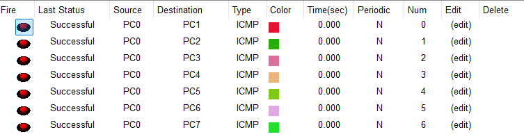
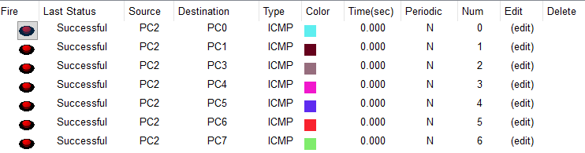
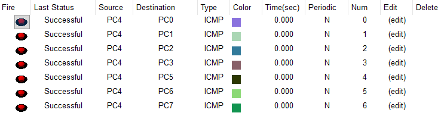
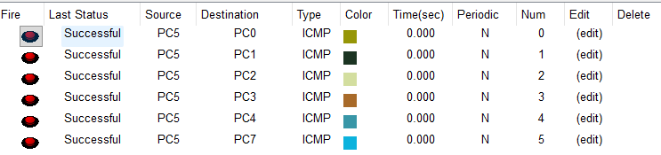
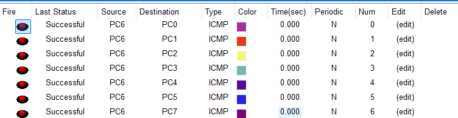
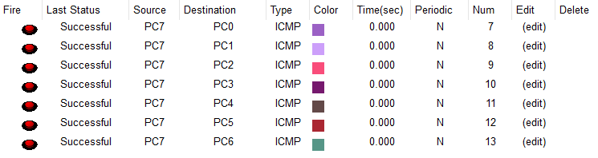

# Ejercicio Propuesto 3: Red Sudamericana (Topología Compleja de 8 Nodos)


## 📖 Descripción del Escenario
Este proyecto representa el desafío final de la guía: interconectar **8 routers** que representan países de Sudamérica en una topología híbrida (Anillo Perimetral + Enlaces Transversales).

El objetivo es lograr **conectividad total (Full Mesh)**, donde cualquier PC de cualquier país pueda comunicarse con las demás, utilizando enrutamiento estático.

## 🏗️ Requisitos Técnicos Críticos

1.  **Hardware:** Se instalaron módulos **WIC-2T** en todos los routers para soportar 3 conexiones seriales simultáneas.
2.  **Capa Física (LAN):** Se utilizaron **Cables Cruzados (Crossover)** para conectar los Routers directamente a las PCs (sin Switch).
3.  **Capa Física (WAN):** Cables Seriales DCE/DTE con `clock rate 64000`.


## 📋 Tabla de Direccionamiento IP

Se utilizó la red base `135.246.0.0/16` para LANs y `33.0.0.0/8` para WANs.

| País | PC Host | IP Gateway (LAN) | Vecino 1 (IP WAN) | Vecino 2 (IP WAN) | Vecino 3 (IP WAN) |
| :--- | :--- | :--- | :--- | :--- | :--- |
| **PERÚ** | PC0 | 135.246.1.1 | Bolivia (33.1.1.1) | Chile (33.1.2.1) | Ecuador (33.1.3.1) |
| **BOLIVIA** | PC7 | 135.246.2.1 | Perú (33.1.1.2) | Colombia (33.1.8.2) | Paraguay (33.1.11.2) |
| **CHILE** | PC1 | 135.246.3.1 | Perú (33.1.2.2) | Paraguay (33.1.4.1) | Brasil (33.1.5.1) |
| **BRASIL** | PC2 | 135.246.4.1 | Chile (33.1.5.2) | Ecuador (33.1.6.1) | - |
| **ECUADOR** | PC3 | 135.246.5.1 | Perú (33.1.3.2) | Brasil (33.1.6.2) | Colombia (33.1.7.1) |
| **COLOMBIA** | PC4 | 135.246.6.1 | Ecuador (33.1.7.2) | Bolivia (33.1.8.1) | Uruguay (33.1.9.1) |
| **URUGUAY** | PC5 | 135.246.7.1 | Colombia (33.1.9.2) | Paraguay (33.1.10.1) | - |
| **PARAGUAY** | PC6 | 135.246.8.1 | Chile (33.1.4.2) | Uruguay (33.1.10.2) | Bolivia (33.1.11.1) |

---


## ⚙️ Configuración Consolidada (Cisco IOS)

Estas configuraciones incluyen las **Rutas de Retorno** necesarias para evitar bucles de enrutamiento.

### 1. Router PERÚ
```bash
enable
conf t
hostname R_Peru
interface FastEthernet0/0
 ip address 135.246.1.1 255.255.255.0
 no shutdown
interface Serial0/0/0
 ip address 33.1.1.1 255.255.255.252
 clock rate 64000
 no shutdown
interface Serial0/0/1
 ip address 33.1.2.1 255.255.255.252
 clock rate 64000
 no shutdown
interface Serial0/1/0
 ip address 33.1.3.1 255.255.255.252
 clock rate 64000
 no shutdown
! Rutas a vecinos y rutas estrategicas
ip route 135.246.2.0 255.255.255.0 33.1.1.2
ip route 135.246.3.0 255.255.255.0 33.1.2.2
ip route 135.246.5.0 255.255.255.0 33.1.3.2
! Para llegar a Brasil mejor ir por Ecuador
ip route 135.246.4.0 255.255.255.0 33.1.3.2
! Default
ip route 0.0.0.0 0.0.0.0 33.1.1.2
exit
```

### 2. Router BOLIVIA
```bash
enable
conf t
hostname R_Bolivia
interface FastEthernet0/0
 ip address 135.246.2.1 255.255.255.0
 no shutdown
interface Serial0/0/0
 ip address 33.1.1.2 255.255.255.252
 clock rate 64000
 no shutdown
interface Serial0/0/1
 ip address 33.1.11.2 255.255.255.252
 clock rate 64000
 no shutdown
interface Serial0/1/0
 ip address 33.1.8.2 255.255.255.252
 clock rate 64000
 no shutdown
! Rutas de retorno criticas
ip route 135.246.1.0 255.255.255.0 33.1.1.1
ip route 135.246.3.0 255.255.255.0 33.1.1.1
ip route 135.246.4.0 255.255.255.0 33.1.1.1
ip route 135.246.7.0 255.255.255.0 33.1.11.1
! Default
ip route 0.0.0.0 0.0.0.0 33.1.8.1
exit
```

### 3. Router CHILE
```bash
enable
conf t
hostname R_Chile
interface FastEthernet0/0
 ip address 135.246.3.1 255.255.255.0
 no shutdown
interface Serial0/0/1
 ip address 33.1.2.2 255.255.255.252
 clock rate 64000
 no shutdown
interface Serial0/1/0
 ip address 33.1.4.1 255.255.255.252
 clock rate 64000
 no shutdown
interface Serial0/0/0
 ip address 33.1.5.1 255.255.255.252
 clock rate 64000
 no shutdown
! Rutas
ip route 135.246.1.0 255.255.255.0 33.1.2.1
ip route 135.246.4.0 255.255.255.0 33.1.5.2
ip route 0.0.0.0 0.0.0.0 33.1.4.2
exit
```

### 4. Router ECUADOR
```bash
enable
conf t
hostname R_Ecuador
interface FastEthernet0/0
 ip address 135.246.5.1 255.255.255.0
 no shutdown
interface Serial0/0/1
 ip address 33.1.6.2 255.255.255.252
 clock rate 64000
 no shutdown
interface Serial0/1/0
 ip address 33.1.3.2 255.255.255.252
 clock rate 64000
 no shutdown
interface Serial0/0/0
 ip address 33.1.7.1 255.255.255.252
 clock rate 64000
 no shutdown
! Rutas
ip route 135.246.1.0 255.255.255.0 33.1.3.1
ip route 135.246.4.0 255.255.255.0 33.1.6.1
ip route 135.246.3.0 255.255.255.0 33.1.3.1
ip route 0.0.0.0 0.0.0.0 33.1.7.2
exit
```

### 5. Router COLOMBIA
```bash
enable
conf t
hostname R_Colombia
interface FastEthernet0/0
 ip address 135.246.6.1 255.255.255.0
 no shutdown
interface Serial0/0/0
 ip address 33.1.7.2 255.255.255.252
 clock rate 64000
 no shutdown
interface Serial0/0/1
 ip address 33.1.9.1 255.255.255.252
 clock rate 64000
 no shutdown
interface Serial0/1/0
 ip address 33.1.8.1 255.255.255.252
 clock rate 64000
 no shutdown
! Rutas
ip route 135.246.1.0 255.255.255.0 33.1.7.1
ip route 135.246.5.0 255.255.255.0 33.1.7.1
ip route 135.246.3.0 255.255.255.0 33.1.7.1
ip route 0.0.0.0 0.0.0.0 33.1.8.2
exit
```

### 6. Router URUGUAY
```bash
enable
conf t
hostname R_Uruguay
interface FastEthernet0/0
 ip address 135.246.7.1 255.255.255.0
 no shutdown
interface Serial0/0/1
 ip address 33.1.9.2 255.255.255.252
 clock rate 64000
 no shutdown
interface Serial0/0/0
 ip address 33.1.10.1 255.255.255.252
 clock rate 64000
 no shutdown
! Rutas
ip route 135.246.1.0 255.255.255.0 33.1.10.2
ip route 135.246.3.0 255.255.255.0 33.1.10.2
ip route 135.246.4.0 255.255.255.0 33.1.10.2
ip route 0.0.0.0 0.0.0.0 33.1.10.2
exit
```

### 7. Router PARAGUAY
```bash
enable
conf t
hostname R_Paraguay
interface FastEthernet0/0
 ip address 135.246.8.1 255.255.255.0
 no shutdown
interface Serial0/0/0
 ip address 33.1.10.2 255.255.255.252
 clock rate 64000
 no shutdown
interface Serial0/1/0
 ip address 33.1.4.2 255.255.255.252
 clock rate 64000
 no shutdown
interface Serial0/0/1
 ip address 33.1.11.1 255.255.255.252
 clock rate 64000
 no shutdown
! Rutas
ip route 135.246.1.0 255.255.255.0 33.1.11.2
ip route 135.246.3.0 255.255.255.0 33.1.4.1
ip route 135.246.4.0 255.255.255.0 33.1.4.1
ip route 0.0.0.0 0.0.0.0 33.1.11.2
exit
```

### 8. Router BRASIL
```bash
enable
conf t
hostname R_Brasil
interface FastEthernet0/0
 ip address 135.246.4.1 255.255.255.0
 no shutdown
interface Serial0/0/0
 ip address 33.1.5.2 255.255.255.252
 clock rate 64000
 no shutdown
interface Serial0/0/1
 ip address 33.1.6.1 255.255.255.252
 clock rate 64000
 no shutdown
! Rutas
ip route 135.246.1.0 255.255.255.0 33.1.6.2
ip route 135.246.3.0 255.255.255.0 33.1.5.1
ip route 0.0.0.0 0.0.0.0 33.1.6.2
exit
```

## 🧪 Verificación Final (Ping)

Se realizaron pruebas ICMP desde **PC0 (Perú)** hacia los nodos más distantes y complicados de la red para verificar que no existen bucles de enrutamiento.

*   **PC0 (Perú) -> PC6 (Paraguay):** Exitoso.
*   **PC0 (Perú) -> PC2 (Brasil):** Exitoso (Ruta optimizada vía Ecuador).
*   **PC1 (Chile) -> PC5 (Uruguay):** Exitoso (Ruta de retorno vía Paraguay).









