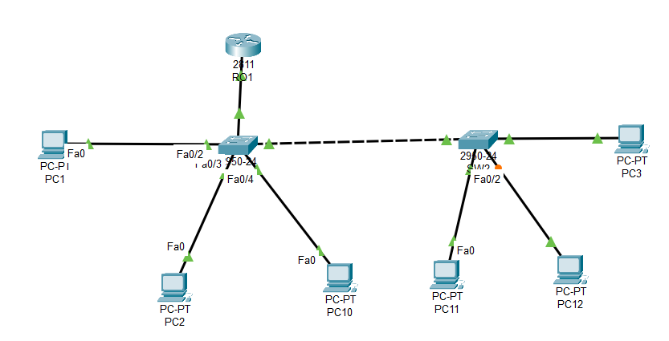

# Laboratorio 2: Enrutamiento Inter-VLAN con Múltiples Switches

Este repositorio documenta la solución del "Ejercicio Propuesto 1" de la guía de laboratorio de Infraestructura de Redes. El objetivo es implementar una red segmentada en VLANs que se extienden a través de dos switches, con la comunicación entre ellas gestionada por un router mediante la técnica "Router on a Stick".

## 🎯 Objetivo del Ejercicio

Configurar una red para una universidad, permitiendo la comunicación entre la VLAN de "Docentes" y la VLAN de "Alumnos". La complejidad de este escenario radica en que los miembros de cada VLAN están distribuidos físicamente en dos switches diferentes, lo que requiere una configuración de enlaces troncales no solo hacia el router, sino también entre los propios switches.

## Topology

La topología de red final implementada en Cisco Packet Tracer es la siguiente:



### Esquema de Direccionamiento y VLANs

| VLAN ID | Nombre | Red | Máscara | Gateway | Dispositivos |
| :--- | :--- | :--- | :--- | :--- | :--- |
| **10** | Docentes | `199.19.9.0` | `255.255.255.0` | `199.19.9.1` | Pc01, Pc02, Pc03 |
| **20** | Alumnos | `170.17.0.0` | `255.255.0.0` | `170.17.0.1` | Pc10, Pc11, Pc12 |

## ⚙️ Configuración de Dispositivos

A continuación se presentan los bloques de comandos completos para cada dispositivo de red.

### 1. Configuración del Switch 1 (SW1)

Este switch actúa como el punto central, conectando con el router y el segundo switch. Por lo tanto, requiere dos puertos troncales.

```cisco
enable
configure terminal

! Crear VLANs
vlan 10
 name Docentes
vlan 20
 name Alumnos
exit

! Configurar puertos de acceso
interface range FastEthernet0/2 - 3  ! Conectan a Pc01 y Pc02 (Docentes)
 switchport mode access
 switchport access vlan 10
exit

interface FastEthernet0/4           ! Conecta a Pc10 (Alumnos)
 switchport mode access
 switchport access vlan 20
exit

! Configurar enlaces troncales (Trunk)
interface FastEthernet0/1           ! Enlace hacia el Router R01
 switchport mode trunk
 no shutdown
exit

interface FastEthernet0/5           ! Enlace hacia el Switch SW2
 switchport mode trunk
 no shutdown
exit

end
write memory
```

### 2. Configuración del Switch 2 (SW2)

Este switch debe tener las mismas VLANs creadas y un enlace troncal hacia SW1 para permitir el paso del tráfico de ambas VLANs.

```cisco
enable
configure terminal

! Crear las mismas VLANs
vlan 10
 name Docentes
vlan 20
 name Alumnos
exit

! Configurar puertos de acceso
interface range FastEthernet0/2 - 3  ! Conectan a Pc11 y Pc12 (Alumnos)
 switchport mode access
 switchport access vlan 20
exit

interface FastEthernet0/4           ! Conecta a Pc03 (Docentes)
 switchport mode access
 switchport access vlan 10
exit

! Configurar enlace troncal (Trunk) hacia SW1
interface FastEthernet0/1
 switchport mode trunk
 no shutdown
exit

end
write memory
```

### 3. Configuración del Router (R01)

El router se configura con subinterfaces, una para cada VLAN, que actuarán como las puertas de enlace predeterminadas.

```cisco
enable
configure terminal

! Encender la interfaz física principal
interface FastEthernet0/1
 no shutdown
exit

! Subinterfaz para VLAN 10 (Docentes)
interface FastEthernet0/1.10
 encapsulation dot1Q 10
 ip address 199.19.9.1 255.255.255.0
exit

! Subinterfaz para VLAN 20 (Alumnos)
interface FastEthernet0/1.20
 encapsulation dot1Q 20
 ip address 170.17.0.1 255.255.0.0
exit

end
write memory
```

## ✅ Verificación

La prueba final consiste en verificar la conectividad entre un PC de la VLAN 10 conectado a SW1 y un PC de la VLAN 20 conectado a SW2.

**Desde el Command Prompt de Pc01 (Docentes):**
```
C:\> ping 170.17.0.4

Pinging 170.17.0.4 with 32 bytes of data:
Reply from 170.17.0.4: bytes=32 time=2ms TTL=126
Reply from 170.17.0.4: bytes=32 time=1ms TTL=126
...
```
Un ping exitoso confirma que toda la configuración de VLANs, trunking y enrutamiento inter-VLAN es correcta.

## 💡 Puntos Clave y Troubleshooting

Durante la resolución de este ejercicio, se abordaron varios puntos críticos de troubleshooting:

1.  **Trunking entre Switches:** Para que las VLANs se extiendan a través de múltiples switches, el enlace que los conecta **debe** ser configurado como un enlace troncal (`switchport mode trunk`) en ambos extremos.
2.  **Tipo de Cable Correcto:** Para conectar dos dispositivos del mismo tipo, como switch a switch, es indispensable usar un cable **Copper Cross-Over** (cruzado). El uso de un cable directo (Copper Straight-Through) impedirá que el enlace se active, manteniendo los puertos en estado `down/down`.
3.  **Puertos Activos:** Es una buena práctica asegurarse de que todas las interfaces troncales estén administrativamente activas mediante el comando `no shutdown`.
4.  **Configuración del Gateway:** El error más común en la capa de usuario es olvidar o configurar incorrectamente la **Puerta de Enlace Predeterminada (Default Gateway)** en los PCs. Sin ella, la comunicación Inter-VLAN es imposible.

---

_Realizado por [Tu Nombre Aquí]_
