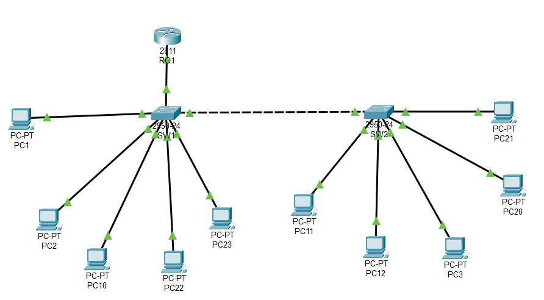

# Laboratorio 3: Ampliación de Red con una Nueva VLAN

Este repositorio documenta la solución del "Ejercicio Propuesto 2", que consiste en ampliar la red previamente configurada en el "Ejercicio Propuesto 1". El objetivo es demostrar la escalabilidad de una red basada en VLANs y trunking.

## 🎯 Objetivo del Ejercicio

El requerimiento es agregar un nuevo grupo de usuarios, "Administrativos", a la red existente de la universidad. Esto implica crear una nueva VLAN (VLAN 30), distribuir sus usuarios en los dos switches existentes y configurar el enrutamiento para permitir la comunicación total entre los tres grupos (Docentes, Alumnos y Administrativos).

## Topology Actualizada

La topología se amplió para incluir cuatro nuevos PCs (PC20, PC21, PC22, PC23) conectados a los switches existentes.



### Esquema de Direccionamiento Final (3 VLANs)

| VLAN ID | Nombre | Red | Máscara | Gateway |
| :--- | :--- | :--- | :--- | :--- |
| **10** | Docentes | `199.19.9.0` | `255.255.255.0`s | `199.19.9.1` |
| **20** | Alumnos | `170.17.0.0` | `255.255.0.0` | `170.17.0.1` |
| **30** | Administrativos | `55.0.0.0` | `255.0.0.0` | `55.0.0.1` |

## ⚙️ Comandos de Ampliación (Cambios Realizados)

No fue necesario reconfigurar la red desde cero. Solo se agregaron los siguientes comandos a la configuración existente.

### 1. Cambios en Switch 1 (SW1)

Se creó la VLAN 30 y se asignaron los puertos `Fa0/10` y `Fa0/11` para los nuevos PCs administrativos (PC22, PC23).

```cisco
configure terminal

! 1. Crear la nueva VLAN
vlan 30
 name Administrativos
exit

! 2. Asignar nuevos puertos a la VLAN 30
interface range FastEthernet0/10 - 11
 switchport mode access
 switchport access vlan 30
 no shutdown
exit

end
```

### 2. Cambios en Switch 2 (SW2)

Se repitió el mismo proceso en SW2 para los PCs PC20 y PC21.

```cisco
configure terminal

! 1. Crear la nueva VLAN
vlan 30
 name Administrativos
exit

! 2. Asignar nuevos puertos a la VLAN 30
interface range FastEthernet0/10 - 11
 switchport mode access
 switchport access vlan 30
 no shutdown
exit

end
```

### 3. Cambios en Router (R01)

Se agregó una nueva subinterfaz (`Fa0/1.30`) para gestionar el enrutamiento de la VLAN 30 y servir como su puerta de enlace.

```cisco
configure terminal

! 3. Crear la subinterfaz para la VLAN 30
interface FastEthernet0/1.30
 encapsulation dot1Q 30
 ip address 55.0.0.1 255.0.0.0
exit

end
```
> **Importante:** Los enlaces troncales existentes (`Fa0/1` en R01, `Fa0/5` en SW1, y `Fa0/1` en SW2) no necesitaron ninguna reconfiguración. Automáticamente comenzaron a transportar el tráfico de la nueva VLAN 30, demostrando el poder del trunking.

### 4. Configuración de los Nuevos PCs

Se añadieron 4 PCs y se configuraron con IPs estáticas y su correspondiente Default Gateway.

| Dispositivo | Conectado a | Dirección IP | Máscara de Subred | Default Gateway |
| :--- | :--- | :--- | :--- | :--- |
| **Pc20** | SW2 | `55.0.0.2` | `255.0.0.0` | **`55.0.0.1`** |
| **Pc21** | SW2 | `55.0.0.3` | `255.0.0.0` | **`55.0.0.1`** |
| **Pc22** | SW1 | `55.0.0.4` | `255.0.0.0` | **`55.0.0.1`** |
| **Pc23** | SW1 | `55.0.0.5` | `255.0.0.0` | **`55.0.0.1`** |

## ✅ Verificación Final

Se realizaron pruebas de `ping` cruzadas entre la nueva VLAN de Administrativos y las VLANs existentes para asegurar la conectividad total en toda la red.

**Ejemplo de prueba desde Alumnos (VLAN 20) a Administrativos (VLAN 30):**
```
C:\> ping 55.0.0.2

Pinging 55.0.0.2 with 32 bytes of data:
Reply from 55.0.0.2: bytes=32 time=2ms TTL=126
...```
El éxito de estas pruebas confirma que la red fue ampliada correctamente.

## 💡 Conclusión Clave

Este ejercicio demuestra la flexibilidad y escalabilidad de una red segmentada con VLANs. Al tener una base sólida con enlaces troncales bien configurados, agregar nuevos grupos de usuarios (VLANs) se convierte en un proceso aditivo y de bajo impacto, sin necesidad de alterar la infraestructura de red existente.

---
