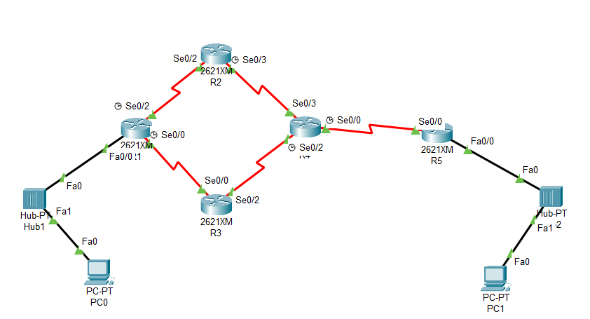

# Solución Ejemplo 1: OSPF Área Única (Adaptado a Topología Real)

## 1. Descripción del Escenario
Configuración de una red OSPF de Área Única (Área 0) utilizando direccionamiento VLSM con el bloque base **2.0.0.0/8**.

Esta configuración ha sido adaptada específicamente para las interfaces mostradas en tu topología de Packet Tracer:
*   Interfaces Seriales: `Se0/0`, `Se0/2`, `Se0/3`.
*   Interfaces Ethernet: `Fa0/0`.



## 2. Tabla de Mapeo de Interfaces

| Router | Interfaz Física | Conexión Hacia | Dirección IP | Máscara Subred |
| :--- | :--- | :--- | :--- | :--- |
| **R1** | `Fa0/0` | LAN (PC0) | 2.0.16.1 | 255.255.248.0 |
|        | `Se0/2` | R2 (Arriba) | 2.0.24.1 | 255.255.255.252 |
|        | `Se0/0` | R3 (Abajo) | 2.0.24.5 | 255.255.255.252 |
| **R2** | `Se0/2` | R1 | 2.0.24.2 | 255.255.255.252 |
|        | `Se0/3` | R4 | 2.0.24.9 | 255.255.255.252 |
| **R3** | `Se0/0` | R1 | 2.0.24.6 | 255.255.255.252 |
|        | `Se0/2` | R4 | 2.0.24.13 | 255.255.255.252 |
| **R4** | `Se0/3` | R2 (Arriba) | 2.0.24.10 | 255.255.255.252 |
|        | `Se0/2` | R3 (Abajo) | 2.0.24.14 | 255.255.255.252 |
|        | `Se0/0` | R5 (Salida) | 2.0.24.17 | 255.255.255.252 |
| **R5** | `Se0/0` | R4 | 2.0.24.18 | 255.255.255.252 |
|        | `Fa0/0` | LAN (PC1) | 2.0.0.1 | 255.255.240.0 |

---

## 3. Scripts de Configuración

### Configuración Router R1
```cisco
enable
configure terminal
hostname R1

! Configurar Loopback para ID estable
interface Loopback0
 ip address 10.0.0.1 255.255.255.255
 no shutdown

! Configurar LAN (2000 hosts)
interface FastEthernet0/0
 ip address 2.0.16.1 255.255.248.0
 no shutdown

! Configurar WAN hacia R2
interface Serial0/2
 description Link to R2
 ip address 2.0.24.1 255.255.255.252
 clock rate 64000
 no shutdown

! Configurar WAN hacia R3
interface Serial0/0
 description Link to R3
 ip address 2.0.24.5 255.255.255.252
 clock rate 64000
 no shutdown

! Configurar OSPF
router ospf 1
 router-id 10.0.0.1
 network 2.0.16.0 0.0.7.255 area 0
 network 2.0.24.0 0.0.0.3 area 0
 network 2.0.24.4 0.0.0.3 area 0
exit
```

### Configuración Router R2
```cisco
enable
configure terminal
hostname R2

interface Loopback0
 ip address 10.0.0.2 255.255.255.255
 no shutdown

! Conexión entrada desde R1
interface Serial0/2
 description Link to R1
 ip address 2.0.24.2 255.255.255.252
 clock rate 64000
 no shutdown

! Conexión salida hacia R4
interface Serial0/3
 description Link to R4
 ip address 2.0.24.9 255.255.255.252
 clock rate 64000
 no shutdown

router ospf 1
 router-id 10.0.0.2
 network 2.0.24.0 0.0.0.3 area 0
 network 2.0.24.8 0.0.0.3 area 0
exit
```

### Configuración Router R3
```cisco
enable
configure terminal
hostname R3

interface Loopback0
 ip address 10.0.0.3 255.255.255.255
 no shutdown

! Conexión entrada desde R1
interface Serial0/0
 description Link to R1
 ip address 2.0.24.6 255.255.255.252
 clock rate 64000
 no shutdown

! Conexión salida hacia R4
interface Serial0/2
 description Link to R4
 ip address 2.0.24.13 255.255.255.252
 clock rate 64000
 no shutdown

router ospf 1
 router-id 10.0.0.3
 network 2.0.24.4 0.0.0.3 area 0
 network 2.0.24.12 0.0.0.3 area 0
exit
```

### Configuración Router R4
```cisco
enable
configure terminal
hostname R3

interface Loopback0
 ip address 10.0.0.3 255.255.255.255
 no shutdown

! Conexión entrada desde R1
interface Serial0/0
 description Link to R1
 ip address 2.0.24.6 255.255.255.252
 clock rate 64000
 no shutdown

! Conexión salida hacia R4
interface Serial0/2
 description Link to R4
 ip address 2.0.24.13 255.255.255.252
 clock rate 64000
 no shutdown

router ospf 1
 router-id 10.0.0.3
 network 2.0.24.4 0.0.0.3 area 0
 network 2.0.24.12 0.0.0.3 area 0
exit
```

### Configuración Router R5
```cisco
enable
configure terminal
hostname R5

interface Loopback0
 ip address 10.0.0.5 255.255.255.255
 no shutdown

! Configurar LAN (4000 hosts)
interface FastEthernet0/0
 ip address 2.0.0.1 255.255.240.0
 no shutdown

! Conexión entrada desde R4
interface Serial0/0
 description Link to R4
 ip address 2.0.24.18 255.255.255.252
 clock rate 64000
 no shutdown

router ospf 1
 router-id 10.0.0.5
 network 2.0.0.0 0.0.15.255 area 0
 network 2.0.24.16 0.0.0.3 area 0
exit
```

## 4. Configuración de Hosts (PCs)

En Packet Tracer, los routers no asignan IPs automáticamente (DHCP) a menos que se configure. Para este laboratorio, configuraremos las IPs de forma **estática** (manual).

### Configuración de PC0 (Red Izquierda - R1)
1.  Haz clic en **PC0**.
2.  Ve a la pestaña **Desktop**.
3.  Haz clic en el icono **IP Configuration**.
4.  Ingresa los siguientes datos exactos:
    *   **IPv4 Address:** `2.0.16.2`
    *   **Subnet Mask:** `255.255.248.0`  *(Nota: Asegúrate de no dejar la máscara por defecto)*
    *   **Default Gateway:** `2.0.16.1`

### Configuración de PC1 (Red Derecha - R5)
1.  Haz clic en **PC1**.
2.  Ve a la pestaña **Desktop**.
3.  Haz clic en el icono **IP Configuration**.
4.  Ingresa los siguientes datos exactos:
    *   **IPv4 Address:** `2.0.0.2`
    *   **Subnet Mask:** `255.255.240.0`
    *   **Default Gateway:** `2.0.0.1`

---

## 5. Verificación de Conectividad y Enrutamiento

Antes de probar, **espera unos 30 segundos** o presiona el botón "Fast Forward Time" (adelantar tiempo) en Packet Tracer para asegurarte de que el protocolo OSPF haya convergido (todos los routers hayan intercambiado sus rutas).

### Prueba 1: PING (Conectividad Básica)
Esta prueba verifica si hay conexión de extremo a extremo.

1.  Abre la ventana de **PC0**.
2.  Ve a la pestaña **Desktop** > **Command Prompt**.
3.  Escribe el siguiente comando y presiona Enter:
    ```cmd
    ping 2.0.0.2
    ```

**Resultado Esperado:**
*   Es normal que el **primer** paquete falle (`Request timed out`) debido al protocolo ARP (resolución de direcciones MAC).
*   Los siguientes paquetes deben decir `Reply from 2.0.0.2: bytes=32 time=... TTL=...`.
*   Si todos fallan, verifica la Máscara de Subred en los PCs y que las interfaces seriales tengan `clock rate`.

### Prueba 2: TRACERT (Trazado de Ruta)
Esta prueba muestra por qué routers está pasando la información. OSPF elige el camino más corto (el de mayor ancho de banda/menor costo).

1.  En la misma ventana de comandos de **PC0**, escribe:
    ```cmd
    tracert 2.0.0.2
    ```

**Resultado Esperado:**
Deberías ver una lista de saltos (Hops) similar a esta lógica:
1.  `2.0.16.1` (Tu Gateway, R1)
2.  `2.0.24.x` (IP de enlace entre routers, probablemente pase por R2 o R3)
3.  `2.0.24.x` (IP de enlace hacia R4)
4.  `2.0.24.18` (Entrada a R5)
5.  `2.0.0.2` (Destino final PC1)